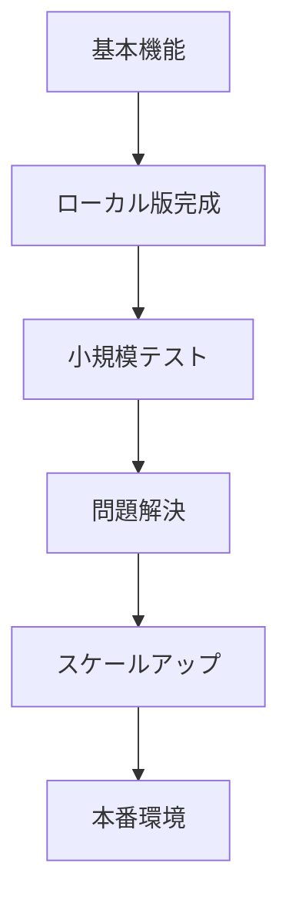

# HETEMLMonitor GitHub Actions版 開発中止の要因分析と教訓

**作成日**: 2025年9月1日  
**プロジェクト**: HETEMLMonitor  
**状況**: GitHub Actions版の開発を中止、ローカル版のみ運用継続

---

## 📋 概要

HETEMLMonitorのGitHub Actions版は、継続的な問題が解決できず開発を中止しました。このドキュメントでは、開発中止の要因と原因を分析し、今後の開発に活かすべき教訓をまとめています。

---

## 🚨 主要な問題点

### 1. **アーティファクト管理の問題**
- **症状**: `file_history.json`が正しくダウンロード・永続化されない
- **影響**: 毎回「初回実行」として認識され、24,000個以上のファイルを処理
- **結果**: 30分タイムアウトで処理が完了しない

### 2. **GitHub Actionsの制約**
- **実行時間制限**: 無料枠で6時間、有料枠でも最長6時間
- **大量ファイル処理**: 初回実行で3時間20分必要
- **アーティファクトサイズ**: 大きなファイル履歴の管理が困難

### 3. **技術的アーキテクチャの不適合**
- **設計思想**: ローカル環境向けの設計をGitHub Actionsに移植
- **スケーラビリティ**: 大量ファイル処理に適していない
- **永続性**: 実行間での状態保持が不安定

---

## 📊 問題の詳細分析

### **アーティファクト管理の問題**
```
問題の流れ:
1. ワークフロー実行開始
2. 前回のfile_history.jsonをダウンロード試行
3. ダウンロード失敗または破損
4. 新規file_history.json作成
5. 24,000個のファイルを処理開始
6. 30分タイムアウトで強制終了
7. 次回実行時も同じ問題が発生
```

### **根本原因**
1. **GitHub Actionsの制約**: 実行環境が毎回クリーン
2. **アーティファクトの信頼性**: 大きなJSONファイルの転送が不安定
3. **エラーハンドリング**: アーティファクト取得失敗時の適切な処理が不十分

---

## 🎯 今後の開発に活かすべき教訓

### **1. プラットフォーム選択の重要性**
```yaml
# 良い例: プラットフォーム特性を考慮した設計
- ローカル環境: 大量ファイル処理、長時間実行
- GitHub Actions: 軽量な処理、短時間実行
- クラウドサービス: スケーラブルな処理、永続性重視
```

### **2. アーキテクチャ設計の原則**
```python
# 良い例: プラットフォームに依存しない設計
class FileMonitor:
    def __init__(self, storage_backend):
        self.storage = storage_backend  # 抽象化されたストレージ
    
    def save_history(self, data):
        return self.storage.save(data)  # プラットフォーム非依存
```

### **3. エラーハンドリングとフォールバック**
```python
# 良い例: 堅牢なエラーハンドリング
def load_file_history(self):
    try:
        # 主要な方法を試行
        return self.download_artifact()
    except ArtifactError:
        try:
            # 代替方法を試行
            return self.create_fresh_history()
        except Exception as e:
            # 最終的なフォールバック
            return self.emergency_fallback()
```

---

## ✅ 今後の開発チェックリスト

### **事前検証項目**
- [ ] プラットフォームの制約を理解している
- [ ] 処理時間の見積もりが適切か
- [ ] データ永続化の方法が確実か
- [ ] エラー時のフォールバックが用意されているか

### **設計時の考慮事項**
- [ ] プラットフォーム特性に合わせたアーキテクチャ
- [ ] スケーラビリティの考慮
- [ ] エラーハンドリングの設計
- [ ] テスト環境での十分な検証

### **実装時の注意点**
- [ ] 段階的な機能実装
- [ ] 各段階での動作確認
- [ ] ログとメトリクスの充実
- [ ] 問題発生時の早期発見

---

## 🚀 改善された開発アプローチ

### **1. 段階的開発**


### **2. プラットフォーム特性の活用**
- **ローカル環境**: 大量ファイル処理、長時間実行
- **GitHub Actions**: CI/CD、軽量な自動化
- **クラウドサービス**: スケーラブルな処理

### **3. モニタリングとアラート**
```python
# 良い例: 包括的なモニタリング
class DevelopmentMonitor:
    def __init__(self):
        self.metrics = {}
        self.alerts = []
    
    def track_performance(self, operation, duration):
        self.metrics[operation] = duration
        if duration > self.thresholds[operation]:
            self.raise_alert(f"{operation} took {duration}s")
```

---

## 📚 学習した教訓の要約

1. **プラットフォーム選択**: 処理内容に適した環境を選択
2. **段階的開発**: 小さく始めて段階的に拡張
3. **エラーハンドリング**: 堅牢なフォールバック機能の実装
4. **早期検証**: 問題の早期発見と解決
5. **適切なスコープ**: 一度に多くの機能を実装しない

---

## 🔮 今後の展望

今回の経験を活かし、以下の方針で開発を進めます：

- **ローカル版の安定化**: 既存の機能を確実に動作させる
- **段階的な機能追加**: 小さな改善を積み重ねる
- **プラットフォーム特性の活用**: 各環境の強みを活かした設計
- **継続的な改善**: 運用を通じた問題発見と解決

---

## 📁 関連ドキュメント

- `HETEMLMonitor/README.md` - プロジェクト概要
- `HETEMLMonitor/docs/PROJECT_SUMMARY.md` - 技術仕様
- `chat_history/20250901_HETEMLMonitor_Project_Cleanup_and_Completion.md` - チャット履歴

---

## 🏷️ タグ

- #開発教訓
- #HETEMLMonitor
- #GitHubActions
- #アーキテクチャ設計
- #エラーハンドリング
- #プラットフォーム選択

---

**作成者**: AI Assistant  
**最終更新**: 2025年9月1日  
**バージョン**: 1.0
