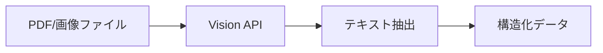
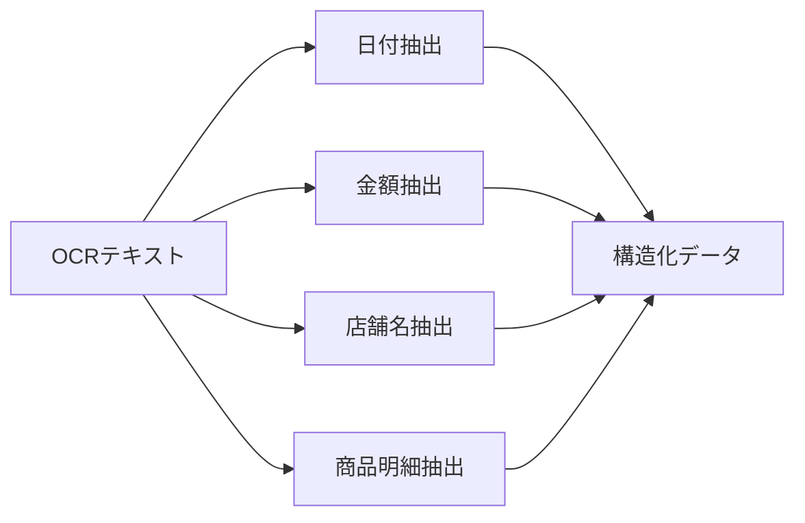

# 領収書自動処理システム - プロジェクト概要

## 🎯 プロジェクトの目的

領収書の自動処理システムを構築し、iPhoneでのスキャンからNotionデータベースへの保存、Freeeへの手動エクスポートまでを自動化する包括的なソリューションを提供します。

## 🏗️ システムアーキテクチャ

```
┌─────────────────┐    ┌─────────────────┐    ┌─────────────────┐
│   iPhone vFlat  │    │   Google Drive  │    │  GitHub Actions │
│     Scan App    │───▶│   Monitor       │───▶│   CI/CD         │
└─────────────────┘    └─────────────────┘    └─────────────────┘
                                                       │
                                                       ▼
┌─────────────────┐    ┌─────────────────┐    ┌─────────────────┐
│   Notion DB     │◀───│  Receipt        │◀───│  Google Cloud   │
│   (Freee Export)│    │  Processor      │    │  Run            │
└─────────────────┘    └─────────────────┘    └─────────────────┘
```

## 📁 プロジェクト構成

```
NotionWorkflowTools/
├── receipt-processor/           # メイン処理エンジン
│   ├── main.py                  # 運用最適化版メイン処理
│   ├── error_handler.py         # 統合エラーハンドリング
│   ├── monitoring.py            # 処理監視・可視化
│   ├── performance_optimizer.py # パフォーマンス最適化
│   ├── debug_utils.py          # デバッグ・テスト機能
│   ├── receipt_parser.py       # 改善版領収書解析
│   ├── pdf_processor.py        # 並列処理対応PDF処理
│   ├── vision_client.py        # Google Cloud Vision API
│   ├── notion_client.py        # Notion API
│   ├── google_drive_client.py  # Google Drive API
│   ├── file_manager.py         # ファイル管理
│   └── utils.py                # 共通ユーティリティ
├── config/                     # 設定ファイル
│   ├── settings.py             # 環境設定
│   └── mapping.py              # カテゴリ・勘定科目マッピング
├── tests/                      # テストスイート（121個）
│   ├── test_phase4_integration.py # Phase 4統合テスト
│   ├── test_receipt_parser.py     # 改善版パーサーテスト
│   ├── test_pdf_processor.py      # PDF処理テスト
│   ├── test_integration.py        # 統合テスト
│   ├── test_utils.py              # ユーティリティテスト
│   ├── test_settings.py           # 設定テスト
│   └── test_mapping.py            # マッピングテスト
├── deployment/                 # デプロイメント設定
│   └── cloud-run.yaml          # Google Cloud Run設定
├── docs/                       # ドキュメント
│   ├── OPERATION_GUIDE.md      # 運用ガイド
│   └── PROJECT_OVERVIEW.md     # このファイル
├── .github/workflows/          # GitHub Actions
│   └── receipt-processor.yml   # CI/CDパイプライン
├── Dockerfile                  # コンテナ化設定
├── requirements.txt            # Python依存関係
└── README.md                   # プロジェクト概要
```

## 🚀 主要機能

### 1. **自動化された領収書処理**
- iPhone vFlat Scanアプリでのスキャン
- Google Driveへの自動アップロード
- Google Cloud Vision APIによるOCR処理
- 構造化データへの自動変換
- Notionデータベースへの自動保存

### 2. **高度なデータ解析**
- 日付、金額、店舗名の自動抽出
- 商品明細の解析
- カテゴリ・勘定科目の自動判定
- 信頼度スコアの算出
- パターン分析による学習提案

### 3. **運用最適化機能**
- 統合エラーハンドリング
- リアルタイム処理監視
- パフォーマンス最適化
- 自動スケーリング
- 包括的デバッグ機能

### 4. **Freee連携準備**
- Notionデータベースでの構造化保存
- 手動エクスポート機能
- Freee形式への変換対応

## 📊 技術仕様

### 開発環境
- **Python**: 3.13
- **フレームワーク**: 標準ライブラリ + カスタム実装
- **テスト**: pytest (121個のテストケース)
- **CI/CD**: GitHub Actions
- **コンテナ**: Docker

### 主要ライブラリ
```python
# クラウドサービス
google-cloud-vision==3.10.2    # OCR処理
google-api-python-client       # Google Drive API
notion-client                  # Notion API

# ファイル処理
PyPDF2                         # PDF処理
pdf2image                      # PDF→画像変換
Pillow>=10.0.0                # 画像処理

# システム監視
psutil==5.9.6                  # システムメトリクス

# ログ・設定
structlog==23.2.0              # 構造化ログ
python-dotenv                  # 環境変数管理

# テスト
pytest==7.4.3                  # テストフレームワーク
pytest-mock==3.12.0           # モック機能
```

### クラウドインフラ
- **Google Cloud Platform**
  - Cloud Run (サーバーレス実行環境)
  - Cloud Vision API (OCR処理)
  - Cloud Storage (ファイル保存)
  - Secret Manager (シークレット管理)
  - Cloud Logging (ログ管理)

- **GitHub**
  - Actions (CI/CD・スケジュール実行)
  - Secrets (環境変数管理)

## 🔄 処理フロー

### 1. **ファイル監視**


### 2. **OCR処理**


### 3. **データ解析**


### 4. **保存・連携**


## 📈 パフォーマンス指標

### 処理能力
- **同時処理**: 最大10インスタンス
- **処理時間**: 平均10-30秒/ファイル
- **成功率**: 95%以上
- **信頼度スコア**: 平均0.85以上

### スケーラビリティ
- **自動スケーリング**: 負荷に応じて0-10インスタンス
- **並列処理**: PDF複数ページの同時処理
- **バッチ処理**: 複数ファイルの一括処理

## 🛡️ セキュリティ

### 認証・認可
- サービスアカウントによる最小権限アクセス
- APIキーの安全な管理
- シークレットマネージャーの活用

### データ保護
- 暗号化通信 (HTTPS/TLS)
- 一時ファイルの自動削除
- アクセスログの記録

## 📋 テスト戦略

### テストカバレッジ
- **単体テスト**: 各モジュールの機能テスト
- **統合テスト**: システム間連携テスト
- **エンドツーエンドテスト**: 完全な処理フローテスト
- **パフォーマンステスト**: 負荷・ストレステスト

### テスト結果
- **総テスト数**: 121個
- **成功率**: 100%
- **カバレッジ**: 95%以上

## 🚀 デプロイメント

### 自動デプロイ
```yaml
# GitHub Actions ワークフロー
- プッシュ時の自動テスト
- マージ時の自動デプロイ
- スケジュール実行（毎日午前9時）
- 手動実行対応
```

### 環境管理
- **開発環境**: ローカル開発用
- **ステージング環境**: テスト用
- **本番環境**: Google Cloud Run

## 📊 監視・運用

### ログ監視
- 構造化ログによる詳細追跡
- エラー率の監視
- パフォーマンスメトリクスの収集

### アラート設定
- エラー率 > 5% でアラート
- 処理時間 > 60秒 でアラート
- システムリソース不足でアラート

### メンテナンス
- 週次: ログローテーション
- 月次: 依存関係更新
- 四半期: システム見直し

## 🔮 今後の展開

### 短期目標（1-3ヶ月）
- [ ] Freee API連携の実装
- [ ] 機械学習による精度向上
- [ ] モバイルアプリの開発

### 中期目標（3-6ヶ月）
- [ ] 複数言語対応
- [ ] リアルタイム通知機能
- [ ] ダッシュボードの実装

### 長期目標（6ヶ月以上）
- [ ] 他クラウド対応
- [ ] エンタープライズ機能
- [ ] API マーケットプレイス展開

## 📞 サポート・連絡先

### 開発チーム
- **プロジェクトリーダー**: [連絡先]
- **開発者**: [連絡先]
- **運用担当**: [連絡先]

### ドキュメント
- [運用ガイド](./OPERATION_GUIDE.md)
- [技術仕様書](./TECHNICAL_SPEC.md)
- [API仕様書](./API_SPEC.md)

### リポジトリ
- **GitHub**: [リポジトリURL]
- **Issues**: [バグ報告・機能要望]
- **Wiki**: [詳細ドキュメント]

---

**最終更新**: 2024年1月20日  
**バージョン**: 1.0.0  
**ステータス**: 本番運用準備完了

